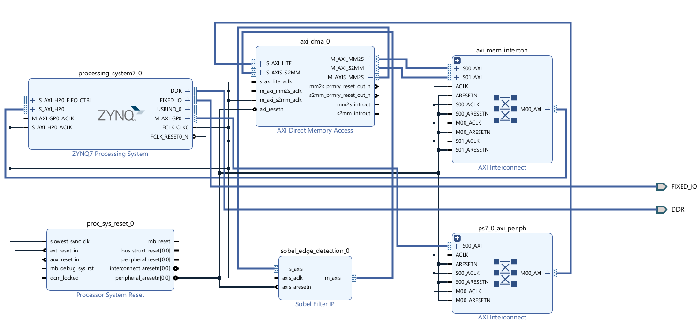

# Hardware Architecture (RTL Design)

[cite_start]The Sobel Edge Detection accelerator is a custom hardware IP designed to process high-throughput image streams with minimal resource overhead[cite: 2, 3]. [cite_start]It utilizes an AXI-Stream interface to communicate with the Zynq Processing System via a DMA engine[cite: 4, 17].

## Top-Level Block Diagram
[cite_start]The architecture is divided into four primary functional stages that transform a 1D sequential pixel stream into a 2D spatial neighborhood for edge calculation[cite: 4].

## 1. AXI-Stream Interface Wrapper
[cite_start]The hardware utilizes the industry-standard AXI-Stream protocol for data movement[cite: 4, 37]. 
* [cite_start]**Slave Interface:** Ingests raw 8-bit grayscale pixels from DDR memory via DMA[cite: 4, 38].
* [cite_start]**Handshaking:** Robustly manages flow control using `tvalid` and `tready` signals to ensure zero data loss during high-speed transfers[cite: 39, 41].
* [cite_start]**Backpressure Support:** If internal line buffers are full, the IP deasserts `s_axis_tready` to safely pause the incoming stream[cite: 42].

## 2. Line Buffer Subsystem
[cite_start]To perform $3 \times 3$ spatial filtering on a continuous pixel stream, the hardware must access three vertically stacked pixels simultaneously[cite: 5, 43]. 
* [cite_start]**Dual-RAM Architecture:** Uses two internal RAM arrays acting as FIFOs to store the two preceding rows of the image (Row N-1 and Row N-2)[cite: 6, 44].
* [cite_start]**Read-Before-Write Logic:** As a new pixel arrives, the hardware simultaneously reads the vertically aligned pixels from both buffers and writes the new pixel into memory, enabling a "conveyor belt" for pixel data[cite: 45].

## 3. $3 \times 3$ Sliding Window
[cite_start]The spatial neighborhood is formed by a $3 \times 3$ grid of 9 shift registers (`p11` through `p33`)[cite: 7, 46].
* [cite_start]**Shift-Register Grid:** On every clock cycle, pixels in the window shift left by one position[cite: 50]. 
* [cite_start]**Neighborhood Maintenance:** The vertical slice of three pixels retrieved from the line buffers enters the rightmost column of the window, maintaining a perfect neighborhood for convolving with the Sobel kernels[cite: 47, 50].

## 4. Sobel Arithmetic Core
[cite_start]The arithmetic unit applies the horizontal ($G_x$) and vertical ($G_y$) kernels to the sliding window[cite: 9, 51].

### Hardware Optimizations
* [cite_start]**Signed 11-bit Arithmetic:** To prevent catastrophic integer underflow when subtracting pixel intensities, $G_x$ and $G_y$ are calculated using signed 11-bit logic[cite: 10, 56].
* [cite_start]**DSP-less Implementation:** Multiplications by 2 (required by the Sobel kernels) are implemented as efficient left bit-shifts (`<< 1`), allowing the entire IP to be synthesized using LUTs and FFs with zero DSP slice utilization[cite: 34, 52].
* [cite_start]**Saturation Clipping:** Final edge magnitudes are summed ($|G_x| + |G_y|$) and clipped at a maximum value of 255 to ensure they fit back into an 8-bit unsigned grayscale format[cite: 10, 57, 60].

## 5. TLAST Generation Logic
[cite_start]To prevent DMA hangs, the IP features a robust 18-bit absolute pixel counter[cite: 25, 26, 62]. [cite_start]This counter independently tracks valid output pixels and forces the `m_axis_tlast` signal high exactly on the final pixel of the frame, ensuring a perfect hardware-to-software handshake[cite: 26, 64, 65].
