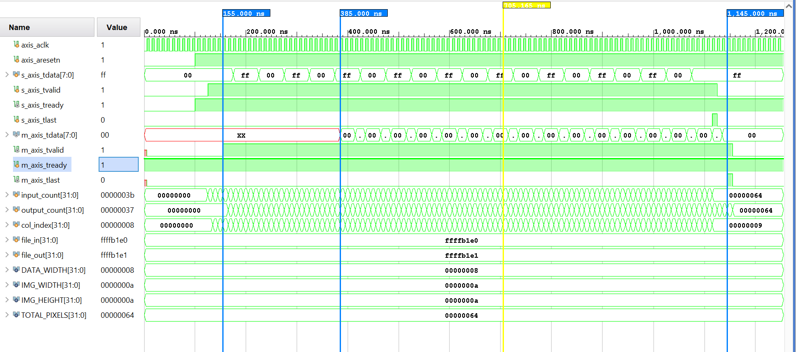

# Simulation and Waveform Analysis

Verification was conducted using three distinct Verilog testbenches to validate the RTL logic from basic functionality to full-frame streaming. All simulations were performed using the Vivado XSIM environment.

## 1. Testbench 1: 10x10 Edge Verification (`tb_sobel_10x10.v`)
This was the primary functional test used to verify the mathematical accuracy of the Sobel kernels on a small, traceable dataset.

* **Methodology:** A 10x10 pixel array was hard-coded into the testbench, featuring clear horizontal and vertical intensity transitions.
* **Objective:** Manually verify that the sliding window correctly captures the 3x3 neighborhood and that the arithmetic core outputs the expected gradient values.
* **Result:** The hardware correctly identified edges. As shown in the waveform below, the internal counters (`input_count` and `output_count`) track the data flow perfectly, with the output beginning only after the line buffers are primed.

## 2. Testbench 2: File-Based Image Verification (`tb_sobel_file.v`)
This testbench validated the IP's performance using real-world data at the target resolution of 256x256.

* **Methodology:** Used standard Verilog file I/O tasks (`$readmemh`) to load a grayscale image converted to hexadecimal. The output was written back to a text file for reconstruction in Python.
* **Findings:**
    * **Latency:** Confirmed a latency of exactly two full rows plus the pipeline stages before the first valid pixel is emitted.
    * **Handshaking:** Verified that the AXI-Stream interface correctly handles `tvalid` and `tready` signals, ensuring no pixels are dropped during the transfer.
    * **Accuracy:** The reconstructed image in Python matched the software-based Sobel reference, proving the 11-bit signed math core works as intended.

## 3. Testbench 3: Mathematical Ramp Test (`tb_sobel_ramp.v`)
This test was designed as a "stress test" for the arithmetic unit without requiring external image files.

* **Methodology:** A continuous ramp signal (pixels incrementing from 0 to 255) was generated within the Verilog code.
* **Findings:**
    * **Arithmetic Bounds:** This confirmed that the absolute magnitude logic ($|G_x| + |G_y|$) and the saturation clipping (capping at 255) function correctly across all possible pixel transitions.
    * **TLAST Reliability:** Verified that the 18-bit `out_pixel_count` triggers the `m_axis_tlast` signal exactly on the 65,536th pixel, which is critical for preventing DMA hangs in the Zynq system.

## Summary of Results
* **Resource Optimization:** By excluding simulation-only file I/O code from the synthesis top-level, we kept the IP lightweight and focused on hardware efficiency.
* **Timing Closure:** All simulations confirmed that the design operates reliably at the target **100 MHz** frequency with a clear 10ns period.
* **Pipeline Integrity:** The use of `buff_valid` and `calc_valid` signals successfully masked the "XX" uninitialized data during the initial buffer-filling phase, ensuring the DMA only receives valid edge data.
