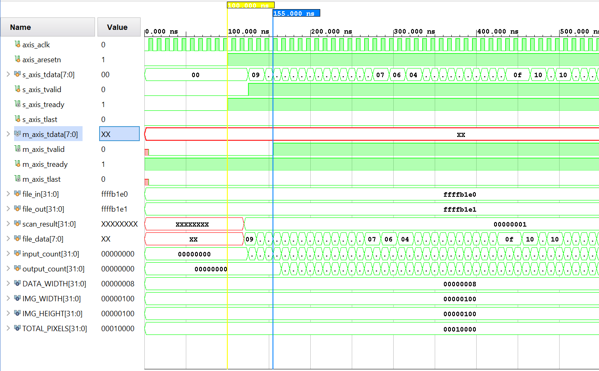
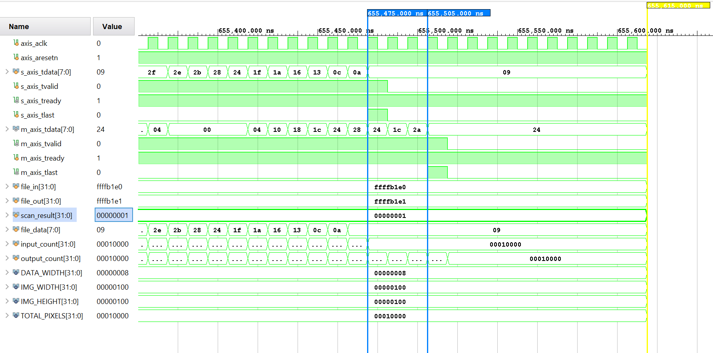
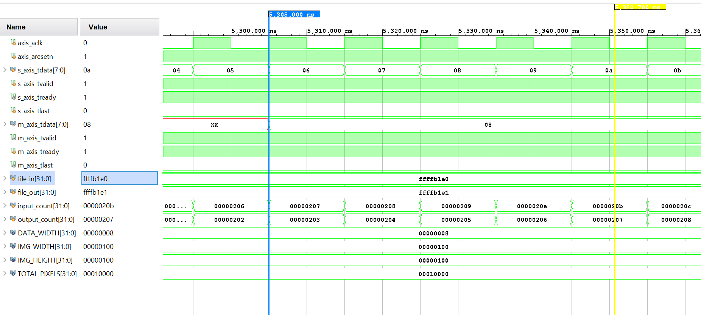

# Verification and Simulation

The Sobel accelerator's RTL was rigorously verified using a multi-stage simulation strategy in Vivado. To ensure AXI-Stream compliance and mathematical accuracy, three distinct testbenches were developed.

## 1. 10x10 Visual Edge Verification (tb_sobel_10x10.v)
Before processing high-resolution images, a micro-scale simulation was performed to verify the core sliding window and line buffer mechanics.

* **Objective:** Process a 10x10 image containing a sharp vertical edge (Black on the left, White on the right).
* **Observation:** The hardware correctly identified the internal edge and reproduced the expected border effects for a 2D spatial filter.
* **Result:** PASS. TLAST fired precisely on the 100th pixel.

## 2. 256x256 Full-Frame Integration (tb_sobel_file.v)
This testbench simulated the exact behavior of the PYNQ SoC environment by streaming real image data into the IP core.

* **Methodology:** A Python script extracted pixel values from a real image into a hexadecimal text file (input_image.txt). The testbench read this file, drove the AXI-Stream slave interface, and captured the output stream into output_image.txt.
* **Verification:** The output text file was reconstructed into an image using Python, confirming perfectly sharp edges on real-world data.
* **Handshake Proof:** The simulation confirmed that m_axis_tlast synchronizes perfectly with the 65,536th valid output pixel, ensuring the DMA receive channel closes correctly.

**Pipeline Startup (Buffer Fill Delay):**

**Pipeline Conclusion (TLAST Handshake):**

## 3. Mathematical Ramp Stress Test (tb_sobel_ramp.v)
To verify the 11-bit signed arithmetic core, the hardware was subjected to a continuous mathematical ramp (0 to 255 repeating).

* **Objective:** Force every logic gate in the arithmetic unit to toggle on every clock cycle to check for overflow or timing glitches.
* **Result:** The hardware correctly calculated the derivative of a constant slope, producing a consistent output magnitude. This confirmed the math logic remains stable under a maximum-throughput data stream.

## Simulation Challenges Resolved
* **Pipeline Starvation:** Early simulations stopped prematurely, leaving the final row stuck in the hardware. This was resolved by extending the testbench run-time to allow the pipeline to flush completely.
* **Initial Latency:** Output data shows "Unknown" (XX) states for the first 514 pixels. This was determined to be correct behavior, as the line buffers require two full rows plus pipeline latency to produce the first valid window. m_axis_tvalid correctly remains low during this period.
